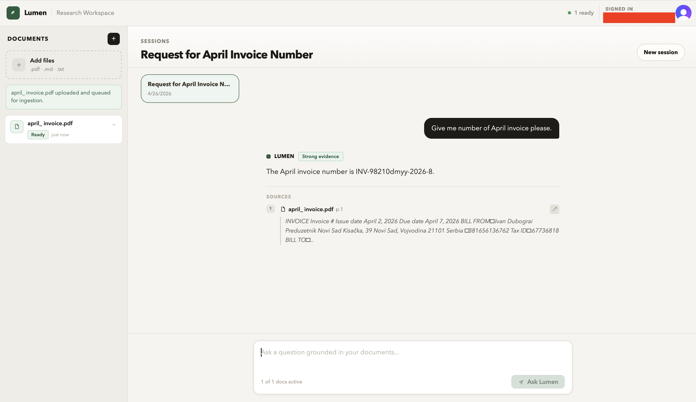

# RAG Service

RAG Service is a production-ready RAG application. Signed-in users upload `.txt`, `.md`, or `.pdf` documents, a worker ingests them asynchronously, and the chat UI answers questions using grounded context from the shared ready-document corpus.

The project demonstrates the shape of a real service, not a toy RAG script: authenticated browser flows, FastAPI service boundaries, background ingestion, `pgvector` retrieval, object storage, streaming chat responses, citations, abstention when evidence is weak, and Docker-based local reproducibility.

## Preview



## Demo

Demo video or GIF: coming soon.

Suggested walkthrough:

1. Sign in through the web UI.
2. Upload a small document and wait for it to become `ready`.
3. Ask a question answered by the document and inspect the citations.
4. Ask an unsupported question and confirm the assistant abstains instead of guessing.
5. Trace the upload or chat request through health checks and structured logs.

See [docs/demo-script.md](./docs/demo-script.md) for a fuller interview/demo script.

## What It Demonstrates

- A single-workspace RAG product with shared ready documents and per-user chat sessions.
- FastAPI API routes backed by SQLAlchemy, Alembic, Postgres, and `pgvector`.
- A long-running worker that handles document ingestion and async session-title jobs.
- S3-compatible object storage for uploaded source files.
- Vue 3, TypeScript, Vite, Vue Router, and Clerk-protected workspace routes.
- Streaming chat over an authenticated backend endpoint, with durable session history after completion.
- Grounding behavior that returns citations when supported and abstains when retrieval is too weak.
- Reproducible local infrastructure with Docker Compose, MinIO, Postgres, backend, worker, and frontend services.
- CI-oriented quality checks across backend tests, frontend type/build checks, and Docker build validation.

## Architecture

```text
Browser (Vue + Clerk)
  |
  | /api/* through nginx
  v
FastAPI backend ---- Postgres + pgvector
  |                    ^
  |                    |
  v                    |
S3-compatible storage  |
  ^                    |
  |                    |
Worker ---------------+
  |
  v
OpenAI-compatible embedding/chat provider
```

Upload flow:

1. The frontend uploads a document to `POST /api/documents`.
2. The backend stores the source file, creates a document row, and queues an ingestion job.
3. The worker parses, chunks, embeds, and indexes the document.
4. The document becomes searchable only after it reaches `ready`.

Chat flow:

1. A signed-in user creates or resumes a personal chat session.
2. The backend embeds the question and searches shared ready chunks.
3. The chat service streams grounded answer text, then persists the final assistant message with citations.
4. If the evidence is insufficient, the assistant returns an abstention response.

## Quick Start

Prerequisites:

- Docker Desktop or Docker Engine with Compose
- An OpenAI API key
- Clerk publishable key and JWT public key for signed-in browser flows, or local auth mode for faster development

```bash
cp .env.example .env
docker compose up --build
```

Open the app at `http://localhost:5173`.

For local development without Clerk, set both auth modes in `.env` before starting the stack:

```env
AUTH_MODE=local
VITE_AUTH_MODE=local
```

This signs the app in as `Local Dev User` while keeping the same backend upload, ingestion, retrieval, streaming chat, citation, and session behavior. Use Clerk mode for realistic demos and auth validation.

To verify the local-auth browser path:

```bash
make e2e-local-auth
```

Useful local URLs:

- Backend API: `http://localhost:8000`
- Live health: `http://localhost:8000/health/live`
- Ready health: `http://localhost:8000/health/ready`
- MinIO console: `http://localhost:9001`

For environment details, local commands, and service maps, see [docs/local-development.md](./docs/local-development.md).

## Verification

Backend:

```bash
cd backend
uv sync --extra dev
uv run ruff check app tests --ignore UP042
uv run pytest tests -q
```

Frontend:

```bash
cd frontend
npm ci
npm run typecheck
npm run build
```

E2E smoke:

```bash
make e2e
```

Docker:

```bash
docker compose config
docker build -f backend/Dockerfile .
docker build -f frontend/Dockerfile .
```

Focused RAG quality checks:

```bash
cd backend
uv run pytest tests/evals -q
```

See [docs/testing.md](./docs/testing.md) for the full validation guide.

## Docs Index

- [Local development](./docs/local-development.md): environment variables, Compose commands, service map, API surface, and workflow details.
- [Testing](./docs/testing.md): backend, frontend, Docker, CI, E2E, and RAG quality checks.
- [Deployment](./docs/deployment.md): manual cloud deployment shape for frontend, backend, worker, Postgres, and object storage.
- [Troubleshooting](./docs/troubleshooting.md): common local failures and how to diagnose them.
- [Demo script](./docs/demo-script.md): portfolio walkthrough, talking points, and future video notes.

## Project References

- [Product Steering](./steering/product.md)
- [Tech Steering](./steering/tech.md)
- [Structure Steering](./steering/structure.md)
